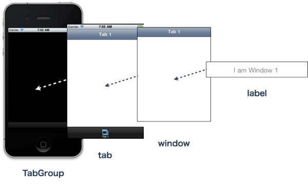
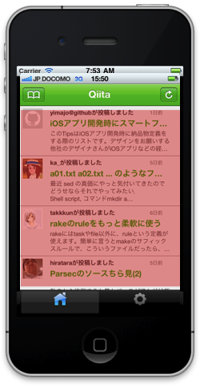
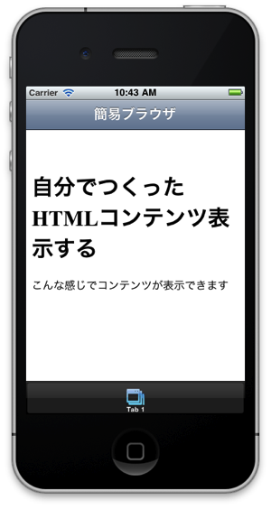

# ワークショップ「JavaScriptでスマフォアプリ開発を学ぼう」入門編


## はじめに
このワークショップでは、JavaScript でiPhone/Android向けのアプリの開発が出来るTitanium Mobileというアプリケーションを使ったスマフォアプリの作り方を教えます

ワークショップの所要時間としては60分程度を想定しております。

## 想定対象者

- 「こんなスマートフォンのアプリが欲しい」と具体的なアイデアを持ってる
- HTML/CSS のコーディング程度は可能なレベル
- Macをお持ちの方で、事前にXCodeとTitanium Studio のインストールを終えてる方

## Titanium Mobileとは？

まず、一般的なスマートフォン向けアプリの開発の概念についておさらいします

### 一般的なスマートフォン向けアプリの開発の概念

iPhone向けのアプリ開発の場合には以下を習得する必要があるかと思います

1. Objective-C 文法を覚える
2. 作りたいアプリに関するAPIを理解
3. 標準ライブラリ（拡張ライブラリ）利用法学ぶ

また、Android向けのアプリ開発の場合には以下を習得する必要があるかと思います

1. Javaの文法を覚える
2. 作りたいアプリに関するAPIを理解
3. 標準ライブラリ（拡張ライブラリ）利用法学ぶ


もしも、iPhone/Android 両方のプラットフォーム向けにアプリケーション開発を行う場合には、それぞれ違う言語＆API覚える必要が出てきます

### Titanium Mobileの場合の開発

1. JavaScriptの文法を覚える
2. 作りたいアプリに関するAPIを理解
3. ライブラリ利用方法などを学ぶ(*1)

という流れになります。

Web開発経験がある人には比較的馴染みがあるJavaScriptという言語を使い、Titanium Mobileが提供する APIを理解することで、iPhone/Android 両方のプラットフォーム向け開発を同時に進めることができます。

ただし、

- iPhoneにふさわしいユーザインタフェース
- Androidにふさわしいユーザインタフェース

とでは異なる部分があるため、ユーザインタフェース以外の所は共通のソースコードを利用しつつ、それぞれのOSに向いたユーザインタフェースは別に分けて開発するようなことが現実問題出てくるのでその点は頭の片隅に入れておいたほうがよいかと思います


Node.jsの開発などをしている人には馴染みがあるCommonJSにTitanium Mobileも準拠しております。

(*1) もしも規模が大きいアプリ開発をする必要が生じた場合には、Appcelerator公式のMVC モデルのフレームワークであるAlloy MVC Frameworkの利用をオススメします

## Titanium Mobileの動作原理

### アーキテクチャ
JavaScriptのプログラムからObjective-CやJavaで構築されたTitaniumMobileのAPIを呼び出して動作します

誤解されやすいですがJavaScriptのコードがObjective-CやJavaに自動変換されているわけではありません


### Titanium Mobileが提供するAPI

iPhone/AndroidのそれぞれのAPIをより簡単かつ共通的に操作できるようになってます。

代表的な機能としては以下のようになります

- NativeUI:ラベル、テキスト入力、ボタン等、Webブラウザ機能
- メディア機能:画像、動画の表示
- データI/O:ファイルシステムの操作SQLiteデータベース
- ネットワーク通信:XHR(XMLHttpRequest)Socket通信
- デバイス操作:カメラ、GPS

### 統合開発環境Titanium Studioについて

Titanium Studioとはコード補完、Git連携をサポートしたエディタ、プロジェクトの管理、シミュレーター、実機でのアプリの実行機能を持った統合開発環境になります。詳しくは[こちらを参照してください](http://bit.ly/vBbq20)

Titanium Studioは、Aptana Studioがベースになっているので、細かい使い方についてはAptanaの情報も参考になると思います。

## アプリケーション開発にチャレンジしましょう

Titanium Mobile の概要が理解できた所で実際にアプリケーション開発にチャレンジしましょう。

最初に、Titanium Studioでのプロジェクト設定方法について説明した後に、Webサイトを表示出来る簡易Webブラウザのようなアプリケーションを作ります

### プロジェクト設定方法の流れ

#### プロジェクト設定

TitaniumStudioを起動した後、File→New→Titanium Mobile Projectと進みます

右記画面が表示されますので今回は以下入力してプロジェクトの設定を行います

- Project name:webbrowse
- App Id:com.street-academy.webbrowse

今回はローカルでの作業のため App Idを仮にこのようにしましたがAppStoreで配布する場合、他のアプリケーションと重複することは出来ません。

#### プロジェクト設定後

Titanium Studio が自動的にいくつかのフォルダ＆ファイルを自動生成して最終的に以下のような画面が表示されます


app.js以外のファイルは基本的には編集することはありません。

Titanium Studio 起動時にはウィンドウが複数表示されて画面が狭く感じる場合、レイアウト変更可能です

もしもフォントが小さく感じる場合には、補足資料の項目を参照して下さい

#### 実際にbuildして動作確認しましょう

Titanium Studio の画面のApp Explorer のウィンドウを選択して

1. 赤色のボタンをクリックします
2. iPhone Simulatorを選択します

しばらくすると以下のようにiPhone Simulatorが立ち上がります


ここまでの動作確認が出来たら、Webサイトを表示出来る簡易Webブラウザのようなアプリケーションを作ります

## Webサイトを表示出来る簡易Webブラウザのようなアプリケーション開発

### 自動的に生成されるapp.js のソースコード解説

プロジェクト設定完了時に、自動的に生成されるapp.jsについてまずは解説します。

App Explorerからapp.jsをダブルクリックしてapp.jsを開きます

もしも、App Explorerがどこにあるかわからない場合にはTitanium StudioのメニューでWindow→Show View→App Explorerを選択するとApp Explorerが表示されます


```javascript
// this sets the background color of the master UIView (when there are no windows/tab groups on it)
Titanium.UI.setBackgroundColor('#000');
// create tab group
var tabGroup = Titanium.UI.createTabGroup(); // (1)
//
// create base UI tab and root window
//
var win1 = Titanium.UI.createWindow({   // (2)
    title:'Tab 1',
    backgroundColor:'#fff'
});
var tab1 = Titanium.UI.createTab({      // (3)
    icon:'KS_nav_views.png',
    title:'Tab 1',
    window:win1
});
var label1 = Titanium.UI.createLabel({  // (4)
	color:'#999',
	text:'I am Window 1',
	font:{fontSize:20,fontFamily:'Helvetica Neue'},
	textAlign:'center',
	width:'auto'
});
win1.add(label1);                       // (5)
// 以下省略
```

1. Tabを格納するためのTabGroupを生成tabGroupという名前を付けてます
2. タイトルが「Tab 1]、背景色が白（#fff）のWindowを生成win1という名前を付けてます
3. タイトルが「Tab 1]、アイコンを指定、対応するWindowとしてWin1を指定したTabを生成。tab1という名前を付けてます
4. 表示内容「I am Window 1」、表示色を灰色（#999）、フォント名＆サイズを指定したLabelを生成。label1という名前を付けてます
5. win1の内部にlabel1を配置してます

ここまでのUIイメージは以下のようになります



### 指定したURLを表示する機能の実装

先ほどのapp.jsのソースコードの一部を改造して、指定したURLのサイトを表示できるようにします

```javascript
// 以下は既存のapp.jsがそのまま活用できます
Titanium.UI.setBackgroundColor('#000');
var tabGroup = Titanium.UI.createTabGroup();
var win1 = Titanium.UI.createWindow({  
    title:'Tab 1',
    backgroundColor:'#fff'
});
var tab1 = Titanium.UI.createTab({  
    icon:'KS_nav_views.png',
    title:'Tab 1',
    window:win1
});

// WebViewを追加します
var webView = Titanium.UI.createWebView({
	url:'http://www.google.co.jp'
});
win1.add(webView);

tabGroup.addTab(tab1);  
tabGroup.open();
```
上記ソースコードの入力が完了したらbuildして、iPhone Simulator上で以下のように表示されるか確認します


指定したURLを表示するために、Titanium Mobile のWebViewを利用します

#### WebViewとは？
WebKitブラウザ機能とほぼ同等の機能を持った部品です(WebKitとは：WebブラウザのSafariにも標準搭載されるオープンソースソフトウェアでHTML、CSS、JavaScript等を解釈して画面描画を担当してます）
HTML5/CSS3ベースのHTMLコンテンツをほぼそのまま動作させることが可能で、指定したURLのHTMLコンテンツ表示やあらかじめ自分が作成したHTMLコンテンツの表示などを行うことができます



### HTMLコンテンツ準備して表示

先程は、指定したURLを表示する機能を試しましたが今度はあらかじめ準備しておいたHTMLコンテンツを表示する機能を実装します

```javascript
// 以下は既存のapp.jsがそのまま活用できます
Titanium.UI.setBackgroundColor('#000');
var tabGroup = Titanium.UI.createTabGroup();
var win1 = Titanium.UI.createWindow({  
    title:'Tab 1',
    backgroundColor:'#fff'
});
var tab1 = Titanium.UI.createTab({  
    icon:'KS_nav_views.png',
    title:'Tab 1',
    window:win1
});
var htmlContents =  
'<html>' +
    '<head>' +
      '<title>自分で準備したHTMLを表示</title>' +
    '</head>' +
    '<body>' +
      '<h1>自分でつくったHTMLコンテンツ表示する</h1>' +
      '<p>こんな感じでコンテンツが表示できます</p>' +
    '</body>' +
  '</html>';


var webView = Titanium.UI.createWebView({
	html:htmlContents
});
win1.add(webView);

tabGroup.addTab(tab1);  
tabGroup.open();
```
上記をbuildすると以下の様になるかと思います


### 仕上げにWebサイトを表示出来る簡易Webブラウザを作成します

ここまでの内容を踏まえて、最後にWebサイトを表示出来る簡易Webブラウザを作成します

```javascript
Titanium.UI.setBackgroundColor('#FFF');
var tabGroup = Titanium.UI.createTabGroup();
var win1 = Titanium.UI.createWindow({
   title:'簡易ブラウザ',
   backgroundColor:'#fff'
});
var tab1 = Titanium.UI.createTab({
    icon:'KS_nav_views.png',
    title:'Tab 1',
    window:win1
});
// １．URLを入力できるテキストフィールドを準備
var urlBox = Titanium.UI.createTextField({
  color:'#336699',
  top:10,
  left:10,
  width:200,
  height:30,
  hintText:'enter url',
  keyboardType:Titanium.UI.KEYBOARD_URL,
  returnKeyType:Titanium.UI.RETURNKEY_DEFAULT,
  autocapitalization: false,
  borderStyle:Titanium.UI.INPUT_BORDERSTYLE_ROUNDED
});
urlBox.addEventListener('blur',function(e){
  actInd.show();
  webView.url = e.value;
  webView.reload();
});
win1.add(urlBox);

// ２．読み込み処理を中止するボタンを準備
var stopBtn = Ti.UI.createButton({
  title:'stop',
  top:10,
  left:220,
  width:60,
  height:30,
  systemButton:Titanium.UI.iPhone.SystemButton.STOP
});
stopBtn.addEventListener('click',function(e){
  webView.stopLoading();
  actInd.hide();
});
win1.add(stopBtn);
// ３．HTMLコンテンツを表示するためのWebViewを準備
var webView = Titanium.UI.createWebView({
  top:50,
  left:0,
  width:'auto',
  height:'auto'
});
webView.addEventListener('beforeload',function(e){
  actInd.show();
});
webView.addEventListener('load',function(e){
  actInd.hide();
});
win1.add(webView);
// ４．「読み込み中」ということを示すためのActivityIndicatorを準備
var actInd = Titanium.UI.createActivityIndicator({
  top:50,
  height:55,
  width:'auto',
  opacity:0.5,
  color:'#FFFFFF',
  backgroundColor:'#000',
  borderRadius:5,
  borderColor:'#000',
  font:{fontFamily:'Helvetica Neue', fontSize:13},
  message:' Loading...',
  style:Titanium.UI.iPhone.ActivityIndicatorStyle.PLAIN
});
win1.add(actInd);

tabGroup.addTab(tab1);
tabGroup.open();
```

## 補足資料

### App Id

AppIdとは、自分が作成するアプリケーションがAppStore上で唯一のものと判別出来るように利用されるIDのことです。唯一のIDとして名前を考えるときにはドメイン名を反転させたもの＋アプリケーション名が推奨されてます。

仮にアプリケーション名を webbrowse とした場合には、 jp.example.webbrowse のような形になります

### TitaniumStudioのフォント設定

フォントが小さく読みづらい場合Titanium Studio の設定を変更します。

1. TitaniumStudio → Preferencesを選択
2. Generalメニューをクリック
3. Appearanceをクリック
4. Colors and Fontsをクリック
5. TextFontのメニュークリック


