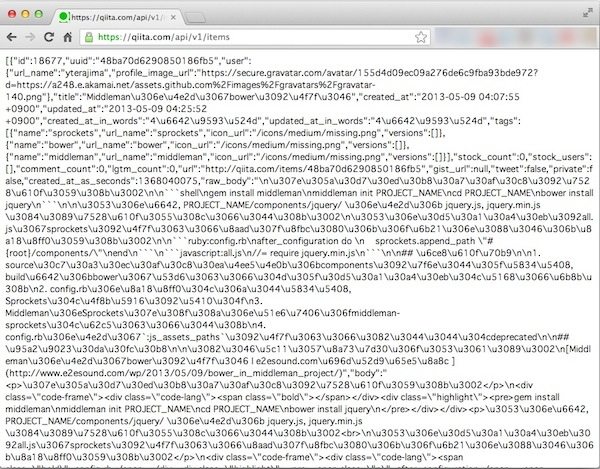

# ワークショップ「JavaScriptでスマフォアプリ開発を学ぼう」基礎編:HttpClientとイベントリスナー


## はじめに
このワークショップでは、JavaScript でiPhone/Android向けのアプリの開発が出来るTitanium Mobileというアプリケーションを使ったスマフォアプリの作り方を教えます

ワークショップの所要時間としては60分程度を想定しております。

## 想定対象者

[「JavaScriptでスマフォアプリ開発を学ぼう」入門編](1stStep.md)を受講済の方を前提としています

## このワークショップで学べること

インターネット上のWeb APIと連携するようなスマートフォン向けのアプリケーションを開発したいというのはよくあるケースかと思います

このワークショップを通じて、ネットワーク通信機能を活用したアプリケーション開発方法について学ぶことが出来ます

## 今回のワークショップのためのプロジェクトを設定する

TitaniumStudioを起動した後、File→New→Titanium Mobile Projectと進みます


Project Template画面が標示されたら、Default Projectを選択します


プロジェクト設定画面が表示されますので今回は以下入力してプロジェクトの設定を行います

- Project name: **httpClient**
- App Id: **com.streetacademy.httpClient**


しばらくすると設定が完了します

## 講座概要

- 端末の通信機能を使ってQiitaの情報を取得する
	- Titanium Mobileの通信機能についての解説
		- Titanium Mobileの 通信機能のhttpClientについて
	- Qiitaの投稿情報を取得するWebAPIの解説
		- QiitaのWebAPIの構造について
		- 実装する前にWebブラウザを使ってQiitaのWebAPIにアクセスする		
	- Qiitaの投稿情報を取得する処理を実装する
		- Titanium Mobileの 通信機能を使って実装する
- 参考資料		
## 端末の通信機能を使ってQiitaの情報を取得する

QiitaのようなWebAPIと連携するアプリを開発する場合に、Titanium Mobile通信機能を使うことで比較的簡単に実現することができます。
この章では

- Titanium Mobileの通信機能についての解説
- Qiitaの投稿情報を取得するWebAPIの解説
- Qiitaの投稿情報を取得する処理を実装する

という３つのステップに分けて順番に解説していきます

### Titanium Mobileの通信機能についての解説

標準機能のhttpCLientを活用することで簡単に実現できますが、まずはhttpCLientの使い方について解説をします。

QiitaのようなWebAPIを提供するWebサービスは多数あるかと思います。そういったWebAPIにアクセスしてXML形式のファイルやJSON形式のテキストファイルを取得する際にTitanium Mobileの標準機能のhttpCLientを活用します。

なお、インターネット上のHTMLコンテンツを取得すること自体はもちろん可能です。ただし、「すべてのimgタグの要素を抜き出す」というようなHTMLの構造を解析した上で、何か処理をしたい場合には、そもそもTitanium MobileのhttpCLientにはそのような機能がありません。

もしもそのような処理をしたい場合には

- US Yahooが提供してる YQLというサービスを使える仕組みがTitanium Mobile 標準にあるのでそれを活用する
- Titanium MobileのhttpCLientでHTMLファイルを取得した後、外部のライブラリなどを活用してHTMLの構文解析をする

という方法で実現出来ます。今回はHTMLファイルを取得する処理は取り上げませんが興味ある方は最後の参考資料の情報を参考にしてみてください

### Qiitaの投稿情報を取得するWebAPIの解説

Titanium Mobileで実装をはじめる前に、Qiitaの投稿情報を取得する時のWebAPIについて簡単に説明します

#### QiitaのWebAPIの構造について

QiitaのWebAPIは

https://qiita.com/api/v1/[利用したいサービス別のディレクトリ]

という形になってます。

[Qiitaの開発者向けのドキュメント](http://qiita.com/docs)に利用したいサービス別のディレクトリ情報などがまとまってますが、ドキュメントの読み方について簡単に説明します

特定ユーザの情報取得の項では

GET /api/v1/users/:url_name

と記載されています

例えば、私のQiita上のユーザ情報（アカウント名はh5y1m141@github)を取得したい場合には **:url_name** の所を該当ユーザに置き換えることで情報が取得出来ます。

具体的には、以下URLにアクセスすることで私のQiita上のユーザ情報を取得することができます

[https://qiita.com/api/v1/users/h5y1m141@github](https://qiita.com/api/v1/users/h5y1m141@github)

```javascript
{"id":10187,"url_name":"h5y1m141@github","profile_image_url":"https://secure.gravatar.com/avatar/4fdf95707fe9a33f3a1ba8c97315468c?d=https://a248.e.akamai.net/assets.github.com%2Fimages%2Fgravatars%2Fgravatar-user-420.png","url":"http://qiita.com/h5y1m141@github","description":"iPhone用のQiita Viewerアプリ作ってます\r\nhttps://github.com/h5y1m141/TiQiita","website_url":"http://h5y1m141.hatenablog.com/","organization":"","location":"","facebook":"","linkedin":"","twitter":null,"github":"h5y1m141","followers":7,"following_users":9,"items":1,"teams":[],"image_upload":{"limit":2097152,"used":0}}
```

#### 実装する前にWebブラウザを使ってQiitaのWebAPIにアクセスする		

実装する前にWebブラウザを使ってQiitaのWebAPIにアクセスして、どのような結果が取得できるのかを確認してみましょう。

Webブラウザを起動して以下URLにアクセスします

[https://qiita.com/api/v1/items](https://qiita.com/api/v1/items)

以下はMac版のGoogle Chromeでアクセスした時の画面イメージになります。



QiitaのWebAPIの構造についておおまかに理解出来たかと思いますので、実際にQiitaの投稿情報を取得する処理を実装していきます。

### Qiitaの投稿情報を取得する処理を実装する

Qiitaの投稿情報を取得するためにTitanium Mobileの 通信機能を使って実装します

#### Titanium Mobileの 通信機能を使って実装する

1. プロジェクト作成時に自動的に生成された **app.jsの中身のソースコードを全て削除**します。
2. その後に以下を記述します

```javascript
var xhr,qiitaURL,method;
qiitaURL = "https://qiita.com/api/v1/items";
method = "GET";
xhr = Ti.Network.createHTTPClient(); // (1)
xhr.open(method,qiitaURL);  // (2)
xhr.onload = function(){
  var body;
  if (this.status === 200) { // (3)
    body = JSON.parse(this.responseText); // (4)
	Ti.API.info(body);
  } else {
    Ti.API.info("error:status code is " + this.status);
  }
}
xhr.onerror = function(e) { // (5)
  var error;
  error = JSON.parse(this.responseText);
  Ti.API.info(error.error);
}
xhr.timeout = 5000;
xhr.send();
```

1. httpClientを利用するためのオブジェクトを生成します

2. open()メソッドを使ってQiitaのWebAPIにアクセスします。最初の引数にHTTPメソッドを指定しますが、Qiitaの投稿の取得をする場合には、GETメソッドを指定する必要があります（詳しくは[Qiitaのドキュメント](http://qiita.com/docs#13)を参照してください)次の引数で投稿情報を取得するQiitaのエンドポイントとなるURLを指定します。

3. QiitaのWebAPIにアクセスして、接続成功したかどうかを判定して、その後の処理を実施します。具体的にはthis.statusの値を確認して、値が200の場合には接続成功しているため該当する処理を実施します

4. this.responseTextの値を確認することで、サーバから取得できた値をテキスト形式で取得できます。this.responseTextは見た目はJSON形式になっていますが、そのまま変数に代入すると文字列としてその後処理されてしまうため、JSON.parse()を使って、JSON化した状態で変数に格納します

5. 例えば、QiitaのWebAPIにアクセスして、150リクエスト/1時間というAPIの利用制限に引っかかってしまう場合などはエラーになり、その時にはonerrorイベントが呼び出されます。

イメージとしては以下のような対応関係になります


動作確認するために、buildした結果は以下のとおりです

iPhone起動時の画面キャプチャ


Android起動時の画面キャプチャ


シミュレーターの画面には何も標示されずコンソール上に複数の文字が標示されるかと思います。

この段階ではTitanium Mobileの通信機能を使ってデータ取得することを目的に実装しているため、スマートフォンの画面表示するところまでは実装していません。
		
## 参考資料
 
### YQL

インターネット上にあるコンテンツをSQLに似た独自言語で取得することが出来るUS Yahooが提供してるWebサービス。

「YQLをTitaniumで使うと色々捗る」というブログ記事でTitanium MobileでのYQL使ったサンプルが紹介されてます
[http://d.hatena.ne.jp/zebevogue/20120421/1334990568](http://d.hatena.ne.jp/zebevogue/20120421/1334990568)
