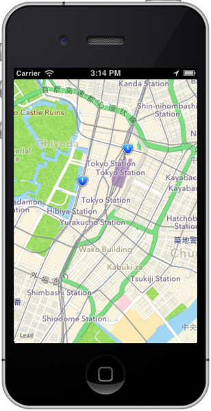

# ワークショップ「JavaScriptでスマフォアプリ開発を学ぼう」基礎編:ACSと連携させた位置情報処理


## はじめに
このワークショップでは、JavaScript でiPhone/Android向けのアプリの開発が出来るTitanium Mobileというアプリケーションを使ったスマフォアプリの作り方を教えます

ワークショップの所要時間としては60分程度を想定しております。

## 想定対象者

[「JavaScriptでスマフォアプリ開発を学ぼう」入門編](1stStep.md)を受講済の方を前提としています

## 今回のワークショップのためのプロジェクトを設定する

TitaniumStudioを起動した後、File→New→Titanium Mobile Projectと進みます


Project Template画面が標示されたら、Default Projectを選択します


プロジェクト設定画面が表示されますので今回は以下入力してプロジェクトの設定を行います

- Project name: **mapWithACS**
- App Id: **com.streetacademy.mapWithACS**


しばらくして設定が完了すると、以下のような画面が表示されればOKです


## 講座概要

- 地図情報を活用したサンプルアプリ
	- 今回作るアプリケーションのイメージ
	- 地図情報を活用したサンプルアプリ開発
		- 地図情報のみを表示する
		- 地図上にマーカーを表示する
- ACSと連携させる
	- ACSとは？
	- ACSと連携したアプリケーション開発
		- 開発前に行う必須作業
		- ACSの管理画面からデータ登録する		
		- ACSに登録したデータを検索して地図上にマーカーを表示する
- 参考資料		
	- 緯度経度と単位について
	- 測地系について
	- 住所から緯度経度を調べる方法
	- スマートフォンの位置情報取得方法について

## 今回作るアプリケーションのイメージ

今回は以下のように地図上の任意の箇所にマーカーが表示されており、マーカーをクリックするとその場所の名称が表示されるアプリケーションを作ります


## 地図情報を活用したサンプルアプリ開発

この章では地図情報を活用したアプリケーションの開発方法について説明していきます。まず最初に地図情報を表示する部分について説明した後に、地図上にマーカーを表示する方法について説明します。

### 地図情報のみを表示する

まず最初にこのような表示が出来るアプリケーションを開発します



1. プロジェクト作成時に自動的に生成された **app.jsの中身のソースコードを全て削除**します。
2. その後に以下を記述します

```javascript
var mapWindow,mapView;

mapWindow = Titanium.UI.createWindow({
  title:'位置情報処理',
  backgroundColor:'#fff'
});
mapView = Titanium.Map.createView({
  mapType: Titanium.Map.STANDARD_TYPE,	// (1)
  region: {								// (2)
    latitude:35.676564,
    longitude:139.765076,		
    latitudeDelta:0.025,
    longitudeDelta:0.025
  },
  animate:true,
  regionFit:true,
  userLocation:true,
  top:0,
  left:0,
  width:Ti.UI.FULL,
  height:Ti.UI.FULL
});
mapWindow.add(mapView);
mapWindow.open();
```

1. 表示する地図の形式を設定します。なおサンプルで設定してる **Titanium.Map.STANDARD_TYPE** 以外に衛星画像を表示する、**Titanium.Map.SATELLITE_TYPE**　と標準地図と衛星地図の両方を表示する **Titanium.Map.HYBRID_TYPE** が設定できます
2. どの地域を地図上で表示するかを決定するのがregionプロパティになります。具体的には緯度を意味する**latitude**と、経度を意味する**longitude** と縮尺に関する情報の**latitudeDelta** と **longitudeDelta** を設定します

latitudeDelta,longitudeDeltaそれぞれについて補足をすると以下のようになります

- latitudeDelta: 現在の縮尺で画面の上端の緯度と下端の緯度の差になります
- longitudeDelta:現在の縮尺で画面の左端の緯度と右端の緯度の差になります

### 地図上にマーカーを表示する

先ほど作ったサンプルアプリでは単に地図を表示するだけのものなので、今度は任意の箇所にマーカーを表示する機能を実装します。

マーカー表示状態ではこのような画面になります


マーカーをクリックした時の画面はこのようになります


```javascript
var mapWindow,mapView,marker;

mapWindow = Titanium.UI.createWindow({
  title:'位置情報処理',
  backgroundColor:'#fff'
});
mapView = Titanium.Map.createView({
  mapType: Titanium.Map.STANDARD_TYPE,
  region: {
    latitude:35.676564,
    longitude:139.765076,
    latitudeDelta:0.025,
    longitudeDelta:0.025
  },
  animate:true,
  regionFit:true,
  userLocation:true,
  top:0,
  left:0,
  width:Ti.UI.FULL,
  height:Ti.UI.FULL
});
// 先ほど作ったアプリに以下を追記します
marker = Titanium.Map.createAnnotation({
  latitude:35.676564,// (1)
  longitude:139.765076, //(2)
  title: "サンプルのマーカーです",		// (3)
  animate: false, //(4)
  leftButton: "", //(5)
  rightButton:"" //(6)
});
mapView.addAnnotation(marker);
// ↑ここまでが追記箇所

mapWindow.add(mapView);
mapWindow.open();
```
1. マーカーを表示したい箇所の緯度情報を設定します
2. マーカーを表示したい箇所の経度情報を設定します
3. マーカーをクリックした時に表示する文字を設定します
4. マーカーを画面表示する時に、画面上部からアニメーションするかどうか設定できます。アニメーション表示したい場合にはtrueにします
5. マーカーをタッチ時のポップアップの左側に独自のアイコン画像を設定することが出来ます。今回のサンプルでは画像無しに設定してます
6. マーカーをタッチ時のポップアップの右側に独自のアイコン画像を設定することが出来ます。今回のサンプルでは画像無しに設定してます

## ACSと連携させる

先ほど作ったアプリケーションでは、緯度、経度の情報を予め設定したものを画面に表示する機能を実装しました。

これだとあまり実用的なアプリケーションとはいえないため、サーバー上に配置した緯度、経度の情報を読み込んだ上で地図上に表示するアプリケーションに仕上げていきますがサーバーサイドのアプリケーションをゼロベースで開発するとなると敷居が高くなってしまうため、Titanium Mobileの開発元のAppceleratorが提供してるACSという便利なサービスを活用していきます。

## ACSとは？

スマートフォン向けのアプリケーションを開発する場合にサーバーサイドのアプリケーションが必要になってきますが、その際に必要となりそうな機能というのは

- ユーザ登録・管理機能・FacebookやTwitter等のソーシャルアカウント連携
- データ共有
- 写真データのアップロード機能
- スマートフォンへのプッシュ通知機能

という形に集約されるケースが多くなるかと思います。

こういう機能を手軽に利用できるようサービスの概念を **MBaaS** （Mobile Backend as a Serviceの略でエムバースという読み方をします）というのものがあります。

Titanium Mobileの開発元のAppceleratorでは MBaaS の１つとしてACSというものを提供してます。

ACSを使うことで、サーバーサイドのアプリケーションを作りこむことなく手軽に位置情報の管理をすることが出来るようになります

## ACSと連携したアプリケーション開発

実際にACSと連携したアプリケーション開発方法について説明します

### 開発前に行う必須作業

ACSと連携したアプリケーションを開発する場合に、アプリケーションに関する情報を管理してるtiapp.xmlの修正をする必要があります。

具体的には以下2つの作業が必要になります

1. デフォルトでは無効になってるCloud Servicesを有効にする
2. ti.cloudというモジュールを利用できるようにする

※ 1.のCloud Servicesを有効にすることで、自動的にti.cloudというモジュールを利用できるようになるはずです。

App Explorer 上で、tiapp.xmlをダブルクリックして、tiapp.xmlを開きます

以下のような画面が標示されるかと思います。

インターネット接続ができる状態であることを念のため確認した上で、Enable　Cloud Servicesの項目のEnableボタンをクリックします


しばらくすると、Enableボタンの表示が切り替わり以下のようにProduction Keyとdevelopment Keyの２つが表示されればOKです


### 今回のサンプルアプリで利用するデータについて

東京タワーと都庁前の2つのサンプルデータを以下に記載しましたのでこちらを利用することにします

#### 東京タワー

- 住所：東京都港区芝公園4-2-8
- 緯度：35.658704
- 経度：139.745408

#### 都庁前

- 住所：東京都新宿区西新宿2-8-1
- 緯度：35.689185
- 経度：139.691648

なお、住所から緯度と経度の情報を調べる方法を参考資料にまとめていますので、今後独自にデータを登録したい場合には、参考資料の情報を参考にご自身で緯度経度を調べた上で登録してみて下さい

### ACSの管理画面からデータ登録する

ACSの管理画面にアクセスして上記データを登録するため、Webブラウザを起動してACSの管理画面の以下URLにアクセスします

[http://my.appcelerator.com/apps](http://my.appcelerator.com/apps)

以下のログイン画面が表示されるので、Titanium Studioを利用する際に利用してるログインIDとパスワードを入力します。


Titanium Mobileで開発してるアプリケーション名の一覧が表示されるので今回作ってるProjectの **mapWithACS** を探して、クリックします


再度ログインを促されるのでログインIDとパスワードを入力します。


以下のようにアプリケーションの管理画面が表示されます


アプリケーションの管理画面では

- テスト環境用のデータ:
- 本番環境用のデータ:

の２つを管理することが出来ます。Development ボタンをクリックすることでテスト環境用の設定に切り替わり、Productionボタンをクリックすることで本番環境用の設定に切り替わります。

AppStoreに公開することがないなら、Developmentボタンをクリックしてテスト環境を利用することをオススメします。今回もDevelopment ボタンをクリックしてテスト環境にデータ登録します

なお、Developmentボタンをクリックすると、Developmentボタンは白文字で緑色が下地になるのでその状態になってることを確認した上で、Places右側に並んでるメニューから **Places** をクリックします


Placesの管理画面が表示されたら、**Create a place** をクリックします


クリック後、以下のような画面が表示されます。


データ登録方法は、Googleローカルの情報を検索するやり方もありますが、位置情報によってはうまく見つからないこともあるので、マニュアル登録をする方法について説明します。Add Manuallyボタンをクリックすると、データ登録画面が表示されます


赤く囲った所は入力必須になってます。東京タワーの情報を例に順番に説明します

- Enter your business name: 場所の名前を入力するので、**東京タワー**と入力します
- Address:ここに住所を入力するため**港区芝公園4-2-8**と入力します
- City: **東京都**と入力します

また、赤枠以外の所は任意ですが、緯度経度が入力されていないと、Titanium Mobileで開発するアプリから検索できなくなるため、以下のように入力します

- latitude：**35.658704**
- longitude：**139.745408**

入力が完了したら、Submitボタンをクリックしてデータ登録は完成です。

この要領で、残りのデータも登録します

### ACSに登録したデータを検索して地図上にマーカーを表示する

ACSにデータを登録する手順を解説しましたが、そのデータを検索して地図上にマーカーを表示する昨日を実装します

ACS上のデータを検索する処理としては

1. ACSを活用するモジュールを読み込む
2. 1.で読み込んだモジュールの機能を活用してデータを検索する処理

に大別できます。

Titanium Mobileの標準のAPIで提供される以上のことを実現するために、開発元だけではなくサードパーティーの会社や、個人の開発者などが、ObjectiveC（Android向けの場合にはJava）で書かれたプログラムを読み込むことが出来ます。

このプログラムのことをネイティブモジュールと呼びます（ネット上では単にモジュールという言い方をしてるケースもあります）

ACSと連携するアプリケーションを作る場合には、Titanium Mobileの開発元のAppceleratorが提供してるモジュールを利用します

#### モジュール読み込み方法

モジュールを読み込む場合には

```javascript
var module = require('モジュール名');
```
のように記述します。

Titanium Mobileの開発元のAppceleratorが提供するACS連携モジュールの場合には

```javascript
var cloud = require('ti.cloud');
```
のように記述します。


#### ACSからデータを検索してその結果を地図上に表示する

先ほど作ったアプリではあらかじめ設定したデータを元にして、任意の場所にマーカーを表示する機能を実装しましたので、それを改造して、ACSからデータを検索してその結果を地図上に表示するアプリケーションを作ります

```javascript
var mapWindow,mapView,marker;

mapWindow = Titanium.UI.createWindow({
  title:'位置情報処理',
  backgroundColor:'#fff'
});
mapView = Titanium.Map.createView({
  mapType: Titanium.Map.STANDARD_TYPE,
  region: {
    latitude:35.676564,
    longitude:139.765076,
    latitudeDelta:0.025,
    longitudeDelta:0.025
  },
  animate:true,
  regionFit:true,
  userLocation:true,
  top:0,
  left:0,
  width:Ti.UI.FULL,
  height:Ti.UI.FULL
});

var cloud = require("ti.cloud"); // (1)
cloud.Places.query({             // (2)
  page:1,                        // (3)
  per_page:20
},function(e){                   // (4)
  var data, i, place, result,marker;
  if(e.success){
    i = 0;
    while(i < e.places.length){  // (5)
      place =  e.places[i];
      marker = Titanium.Map.createAnnotation({
        latitude: place.latitude,
        longitude: place.longitude,
        title: place.name,
        animate: false,
        leftButton: "",
        rightButton:""
      });
      mapView.addAnnotation(marker);
      i++;                       // (6)
    }

  } else {
    Ti.API.info("Error:\n" + ((e.error && e.message) || JSON.stringify(e)));
  }
});

mapWindow.add(mapView);
mapWindow.open();
```
1. ACSを活用するために、モジュールを読み込みます。読み込んだ値を変数cloudに格納しており、これ以降cloud.xxx.xxx()という形でACS上にあるデータを検索したり、登録することが可能になります
2. ACSに登録した時に **places** の項目の情報を検索する時には、Places.query()というメソッドを呼び出すことで実現できます。
3. ACSのデータを検索するときに、Places.query()メソッドにオプションとなる値を設定することで細かい条件検索ができます。今回は件数が少ないですが例えば登録データが1000件あるような場合、per_pageの値を設定することで1検索あたりのデータ数を設定することができます。（今回のように20と指定すると1回あたり20件までしか取得できません）またページと言う概念があるため、最初に20件取得したあと21件目のデータを取得したい場合には、pageという項目に適切な値を設定することで次のデータを取得できます
4. Places.query()メソッドで検索された結果は、コールバック関数に値が引き渡されます。ここの変数eの値を参照することで、検索の成功・失敗や実際のデータが参照できます
5. Places.query()メソッドで検索された結果を順番に得るために、配列のe.placesの長さ分ループ処理をします
6. ループのカウンターとして利用してる変数iの値に1つ増加させます


## 参考情報

### 緯度経度と単位について

- 緯度（latitude）は赤道を０度として北：＋（プラス）南：ー（マイナス）の数字で表現
- 経度（longitude）はグリニッジ天文台跡を南北へ通る子午線を０度として東：＋（プラス）
西：ー（マイナス）の数字で表現


緯度経度を10進法で示すDegree単位で東京駅周辺の丸の内のビルは+35.679113、+139.763137 という形式で表現されます。

※60進で表現する度分秒（DMS）というのもあるそうですがインターネット上ではDegree単位が利用されることが多いそうです


### 測地系について

同じ場所でも利用する測地系（datum）によって緯度経度の値が変わる。日本で気にする必要があるのは以下２つ

- 日本測地系
- 世界測地系

日本では2002年4月1日まで日本測地系が使われてきた経緯があり、サービスによってはまだ日本測地系を利用しているものもあるそうで、日本測地系に基づいた緯度経度と世界測地系のそれとでは、約400mのズレが生じるそうです

### 住所から緯度経度を調べる方法

住所から緯度経度を調べることが出来るWebサービスはいくつかあるようですが、個人的には[Geocoding API](http://www.geocoding.jp/api/)を良く利用してるので東京タワーの住所（東京都港区芝公園4-2-8)を例にして説明します

まずはサイトにアクセスして、検索ボックス欄に住所を入力して、検索ボタンをクリックします


検索完了すると、以下の様なXML形式の情報が画面に表示されるかと思います


```xml
<result>
  <version>1.1</version>
  <address>東京都港区芝公園4-2-8</address>
  <coordinate>
    <lat>35.658704</lat>
	<lng>139.745408</lng>
	<lat_dms>35,39,31.334</lat_dms>
	<lng_dms>139,44,43.469</lng_dms>
  </coordinate>
  <url>
http://www.geocoding.jp/?q=%E6%9D%B1%E4%BA%AC%E9%83%BD%E6%B8%AF%E5%8C%BA%E8%8A%9D%E5%85%AC%E5%9C%924-2-8
  </url>
  <needs_to_verify>no</needs_to_verify>
  <google_maps>東京都港区芝公園４丁目２−８</google_maps>
</result>
```

緯度の情報は、latというタグで囲まれてる値になります。この場合だと35.658704です
経度の情報は、lngというタグで囲まれてる値になります。この場合だと139.745408です


#### 東京タワー

- 住所：東京都港区芝公園4-2-8
- 緯度：35.658704
- 経度：139.745408

#### 都庁前

- 住所：東京都新宿区西新宿2-8-1
- 緯度：35.689185
- 経度：139.691648


### スマートフォンの位置情報取得方法について

たいていのスマートフォンではGPS機能を利用できるかと思いますが、位置についての正確さ、バッテリの消費量、位置情報を取得する時に必要な時間といった部分については、トレードオフの関係が成り立っています。

そのため、精度を要求する場合には、それに伴って計測にかかる時間が長く、バッテリ消費量が大きくなってしまいます


iPhoneの場合にはプログラムから測位方式指定不可ですが、Androidの場合にはプログラムから測位方式指定可能です

