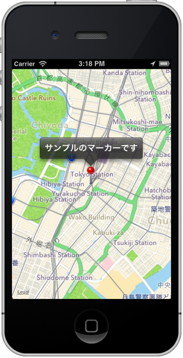
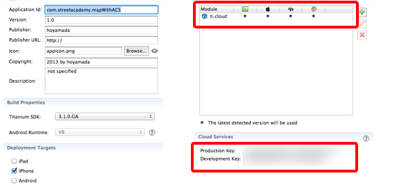
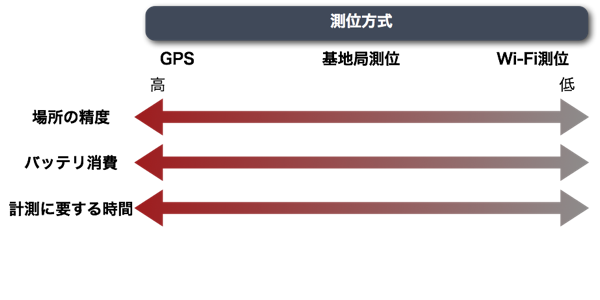

# ワークショップ「JavaScriptでスマフォアプリ開発を学ぼう」基礎編:ACSと連携させた位置情報処理


## はじめに
このワークショップでは、JavaScript でiPhone/Android向けのアプリの開発が出来るTitanium Mobileというアプリケーションを使ったスマフォアプリの作り方を教えます

ワークショップの所要時間としては60分程度を想定しております。

## 想定対象者

[「JavaScriptでスマフォアプリ開発を学ぼう」入門編](1stStep.md)を受講済の方を前提としています

## 今回のワークショップのためのプロジェクトを設定する

TitaniumStudioを起動した後、File→New→Titanium Mobile Projectと進みます


Project Template画面が標示されたら、Default Projectを選択します


プロジェクト設定画面が表示されますので今回は以下入力してプロジェクトの設定を行います

- Project name: **mapWithACS**
- App Id: **com.streetacademy.mapWithACS**


しばらくして設定が完了すると、以下のような画面が表示されればOKです


## 講座概要

- 地図情報を活用したサンプルアプリ
	- 今回作るアプリケーションのイメージ
	- 地図情報を活用したサンプルアプリ開発
		- 地図情報のみを表示する
		- 地図上にマーカーを表示する
- ACSと連携させる
	- ACSとは？
	- ACSと連携したアプリケーション開発
		- 開発前に行う必須作業
- 参考資料		
	- 緯度経度と単位について
	- 測地系について
	- 住所から緯度経度を調べる方法
	- スマートフォンの位置情報取得方法について

## 今回作るアプリケーションのイメージ

ここに今回作るアプリケーションの画面キャプチャを載せる

## 地図情報を活用したサンプルアプリ開発

この章では地図情報を活用したアプリケーションの開発方法について説明していきます。まず最初に地図情報を表示する部分について説明した後に、地図上にマーカーを表示する方法について説明します。

### 地図情報のみを表示する

まず最初にこのような表示が出来るアプリケーションを開発します


1. プロジェクト作成時に自動的に生成された **app.jsの中身のソースコードを全て削除**します。
2. その後に以下を記述します

```javascript
var mapWindow,mapView;

mapWindow = Titanium.UI.createWindow({
  title:'位置情報処理',
  backgroundColor:'#fff'
});
mapView = Titanium.Map.createView({
  mapType: Titanium.Map.STANDARD_TYPE,	// (1)
  region: {								// (2)
    latitude:35.676564,
    longitude:139.765076,		
    latitudeDelta:0.025,
    longitudeDelta:0.025
  },
  animate:true,
  regionFit:true,
  userLocation:true,
  top:0,
  left:0,
  width:Ti.UI.FULL,
  height:Ti.UI.FULL
});
mapWindow.add(mapView);
mapWindow.open();
```

1. 表示する地図の形式を設定します。なおサンプルで設定してる **Titanium.Map.STANDARD_TYPE** 以外に、**Titanium.Map.SATELLITE_TYPE**（衛星画像）と**Titanium.Map.HYBRID_TYPE**(標準地図と衛星地図の両方を表示する)が設定できます
2. どの地域を地図上で表示するかを決定するのがregionプロパティになります。具体的には緯度（**latitude**）経度（**longitude**）と縮尺に関する情報（**latitudeDelta** ,**longitudeDelta**）を設定します


latitudeDelta,longitudeDeltaそれぞれについて補足をすると以下のようになります

- latitudeDelta: 現在の縮尺で画面の上端の緯度と下端の緯度の差になります
- longitudeDelta:現在の縮尺で画面の左端の緯度と右端の緯度の差になります

### 地図上にマーカーを表示する

先ほど作ったサンプルアプリでは単に地図を表示するだけのものなので、今度は任意の箇所にマーカーを表示する機能を実装します。

マーカー表示状態ではこのような画面になります


マーカーをクリックした時の画面はこのようになります



```javascript
var mapWindow,mapView,marker;

mapWindow = Titanium.UI.createWindow({
  title:'位置情報処理',
  backgroundColor:'#fff'
});
mapView = Titanium.Map.createView({
  mapType: Titanium.Map.STANDARD_TYPE,
  region: {
    latitude:35.676564,
    longitude:139.765076,
    latitudeDelta:0.025,
    longitudeDelta:0.025
  },
  animate:true,
  regionFit:true,
  userLocation:true,
  top:0,
  left:0,
  width:Ti.UI.FULL,
  height:Ti.UI.FULL
});
// 先ほど作ったアプリに以下を追記します
marker = Titanium.Map.createAnnotation({
  latitude:35.676564,// (1)
  longitude:139.765076, //(2)
  title: "サンプルのマーカーです",		// (3)
  animate: false, //(4)
  leftButton: "", //(5)
  rightButton:"" //(6)
});
mapView.addAnnotation(marker);
// ↑ここまでが追記箇所

mapWindow.add(mapView);
mapWindow.open();
```
1. マーカーを表示したい箇所の緯度情報を設定します
2. マーカーを表示したい箇所の経度情報を設定します
3. マーカーをクリックした時に表示する文字を設定します
4. マーカーを画面表示する時に、画面上部からアニメーションするかどうか設定できます。アニメーション表示したい場合にはtrueにします
5. マーカーをタッチ時のポップアップの左側に独自のアイコン画像を設定することが出来ます。今回のサンプルでは画像無しに設定してます
6. マーカーをタッチ時のポップアップの右側に独自のアイコン画像を設定することが出来ます。今回のサンプルでは画像無しに設定してます

## ACSと連携させる

### 開発前に行う必須作業

ACSと連携したアプリケーションを開発する場合に、アプリケーションに関する情報を管理してるtiapp.xmlの修正をする必要があります。

具体的には以下2つの作業が必要になります

1. デフォルトでは無効になってるCloud Servicesを有効にする
2. ti.cloudというモジュールを利用できるようにする

※ 1.のCloud Servicesを有効にすることで、自動的にti.cloudというモジュールを利用できるようになるはずです。

App Explorer 上で、tiapp.xmlをダブルクリックして、tiapp.xmlを開きます

以下のような画面が標示されるかと思います。

インターネット接続ができる状態であることを念のため確認した上で、Enable　Cloud Servicesの項目のEnableボタンをクリックします


しばらくすると、Enableボタンの表示が切り替わり以下のようにProduction Keyとdevelopment Keyの２つが表示されればOKです



## 参考情報

### 緯度経度と単位について

- 緯度（latitude）は赤道を０度として北：＋（プラス）南：ー（マイナス）の数字で表現
- 経度（longitude）はグリニッジ天文台跡を南北へ通る子午線を０度として東：＋（プラス）
西：ー（マイナス）の数字で表現


緯度経度を10進法で示すDegree単位で東京駅周辺の丸の内のビルは+35.679113、+139.763137 という形式で表現されます。

※60進で表現する度分秒（DMS）というのもあるそうですがインターネット上ではDegree単位が利用されることが多いそうです


### 測地系について

同じ場所でも利用する測地系（datum）によって緯度経度の値が変わる。日本で気にする必要があるのは以下２つ

- 日本測地系
- 世界測地系

日本では2002年4月1日まで日本測地系が使われてきた経緯があり、サービスによってはまだ日本測地系を利用しているものもあるそうで、日本測地系に基づいた緯度経度と世界測地系のそれとでは、約400mのズレが生じるそうです

### 住所から緯度経度を調べる方法

住所から緯度経度を調べることが出来るWebサービスはいくつかあるようですが、個人的には[Geocoding API](http://www.geocoding.jp/api/)を良く利用してるので東京タワーの住所（東京都港区芝公園4-2-8)を例にして説明します

まずはサイトにアクセスして、検索ボックス欄に住所を入力して、検索ボタンをクリックします


検索完了すると、以下の様なXML形式の情報が画面に表示されるかと思います


```xml
<result>
  <version>1.1</version>
  <address>東京都港区芝公園4-2-8</address>
  <coordinate>
    <lat>35.658704</lat>
	<lng>139.745408</lng>
	<lat_dms>35,39,31.334</lat_dms>
	<lng_dms>139,44,43.469</lng_dms>
  </coordinate>
  <url>
http://www.geocoding.jp/?q=%E6%9D%B1%E4%BA%AC%E9%83%BD%E6%B8%AF%E5%8C%BA%E8%8A%9D%E5%85%AC%E5%9C%924-2-8
  </url>
  <needs_to_verify>no</needs_to_verify>
  <google_maps>東京都港区芝公園４丁目２−８</google_maps>
</result>
```

緯度の情報は、latというタグで囲まれてる値になります。この場合だと35.658704です
経度の情報は、lngというタグで囲まれてる値になります。この場合だと139.745408です


#### 東京タワー

- 住所：東京都港区芝公園4-2-8
- 緯度：35.658704
- 経度：139.745408

#### 都庁前

- 住所：東京都新宿区西新宿2-8-1
- 緯度：35.689185
- 経度：139.691648


### スマートフォンの位置情報取得方法について

たいていのスマートフォンではGPS機能を利用できるかと思いますが、位置についての正確さ、バッテリの消費量、位置情報を取得する時に必要な時間といった部分については、トレードオフの関係が成り立っています。

そのため、精度を要求する場合には、それに伴って計測にかかる時間が長く、バッテリ消費量が大きくなってしまいます



iPhoneの場合にはプログラムから測位方式指定不可ですが、Androidの場合にはプログラムから測位方式指定可能です

