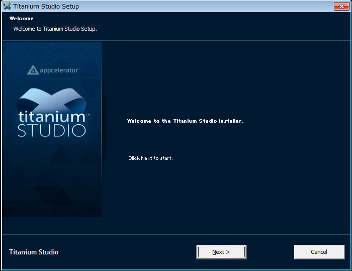

# WindowsでTitanium Mobileを利用するための環境構築と簡単なアプリ開発

## はじめに
このワークショップでは、JavaScript でAndroid向けのアプリの開発が出来るTitanium Mobileというアプリケーションを使ったスマフォアプリの作り方を教えます

ワークショップの所要時間としては60分程度を想定しております。

## 想定対象者

- 「こんなスマートフォンのアプリが欲しい」と具体的なアイデアを持ってる
- HTML/CSS のコーディング程度は可能なレベル

## Titanium Mobileとは？

まず、一般的なスマートフォン向けアプリの開発の概念についておさらいします

### 一般的なスマートフォン向けアプリの開発の概念

Android向けのアプリ開発の場合には以下を習得する必要があるかと思います

1. Javaの文法を覚える
2. 作りたいアプリに関するAPIを理解
3. 標準ライブラリ（拡張ライブラリ）利用法学ぶ

（Macを持ってる方が対象になりますが）iPhone向けのアプリ開発の場合には以下を習得する必要があるかと思います

1. Objective-C 文法を覚える
2. 作りたいアプリに関するAPIを理解
3. 標準ライブラリ（拡張ライブラリ）利用法学ぶ

もしも、Android/iPhone 両方のプラットフォーム向けにアプリケーション開発を行う場合には、それぞれ違う言語＆API覚える必要が出てきます

### Titanium Mobileの場合の開発

1. JavaScriptの文法を覚える
2. 作りたいアプリに関するAPIを理解
3. ライブラリ利用方法などを学ぶ(*1)

という流れになります。

Web開発経験がある人には比較的馴染みがあるJavaScriptという言語を使い、Titanium Mobileが提供する APIを理解することで、iPhone/Android 両方のプラットフォーム向け開発を同時に進めることができます。

ただし、

- iPhoneにふさわしいユーザインタフェース
- Androidにふさわしいユーザインタフェース

とでは異なる部分があるため、ユーザインタフェース以外の所は共通のソースコードを利用しつつ、それぞれのOSに向いたユーザインタフェースは別に分けて開発するようなことが現実問題出てくるのでその点は頭の片隅に入れておいたほうがよいかと思います

Node.jsの開発などをしている人には馴染みがあるCommonJSにTitanium Mobileも準拠しております。

(*1) もしも規模が大きいアプリ開発をする必要が生じた場合には、Appcelerator公式のMVC モデルのフレームワークであるAlloy MVC Frameworkの利用をオススメします

## Titanium Mobileの動作原理

### アーキテクチャ
JavaScriptのプログラムからObjective-CやJavaで構築されたTitaniumMobileのAPIを呼び出して動作します

誤解されやすいですがJavaScriptのコードがObjective-CやJavaに自動変換されているわけではありません

### Titanium Mobileが提供するAPI

iPhone/AndroidのそれぞれのAPIをより簡単かつ共通的に操作できるようになってます。

代表的な機能としては以下のようになります

- NativeUI:ラベル、テキスト入力、ボタン等、Webブラウザ機能
- メディア機能:画像、動画の表示
- データI/O:ファイルシステムの操作SQLiteデータベース
- ネットワーク通信:XHR(XMLHttpRequest)Socket通信
- デバイス操作:カメラ、GPS

### 統合開発環境Titanium Studioについて

Titanium Studioとはコード補完、Git連携をサポートしたエディタ、プロジェクトの管理、シミュレーター、実機でのアプリの実行機能を持った統合開発環境になります。詳しくは[こちらを参照してください](http://bit.ly/vBbq20)

Titanium Studioは、Aptana Studioがベースになっているので、細かい使い方についてはAptanaの情報も参考になると思います。

## Windows環境でのセットアップ手順

1. Windows環境でセットアップする前に、ご自身の環境をチェックします
2. 環境構築のために必要なソフトなどをダウンロードします
3. ダウンロードしたツール、ソフトウェアをインストールします

### ダウンロード手順

Appceleratorのサイトに行き、以下リンク先よりダウンロードします

以下のダイアログが表示されます

 

### Androidの開発に必要なツールのセットアップ

ダウンロードしたJavaSDKのファイルをダブルクリックして実行します

実行すると、以下の様なJavaSDKのセットアップ開始画面が表示されます。次へボタンをクリックします

インストールするオプションについて確認されますが特に変更せずにそのまま次へボタンをクリックします

インストール先について尋ねられます。特に事情がない限りはインストール先はそのまま変更せずに次へボタンをクリックします

この後にインストール作業が開始されます

インストールが完了するとこのような画面が表示されます

Android SDK Managerが起動します

該当のSDKのバージョンを選択して、インストールボタンをクリックします

### Titanium Studioのセットアップ

ダウンロードしたファイルを実行すると以下の様なセットアップ画面が表示されます。Nextボタンをクリックして次の画面に進みます

ライセンスに関する注意書きが表示されます。内容確認して問題無いようでしたら、I Agreeのボタンをクリックして次に進みます

Titanium Studioのインストール先について尋ねられます。特に事情がない限りはインストール先はそのまま変更せずにNextボタンをクリックして次の画面に進みます

Windowsのスタートアップメニューに、Titanium Studioを加えるかどうか聞かれます。特に事情がない限り変更せずに、Nextボタンをクリックして次の画面に進みます

Titanium Studioで編集するプログラムのソースコードのファイルの関連付けについて聞かれます。

- 普段、HTML/CSS/PHPというファイルの編集を別のアプリケーションで編集する方は該当するファイルのチェックボックスを外してからNextボタンをクリックして次の画面に進みます

- 普段、プログラミングをする機会が無い方は、そのまま変更せずNextボタンをクリックして次の画面に進みます。

ここまでの設定が完了したら、Installボタンをクリックして、実際にインストール作業を開始します

